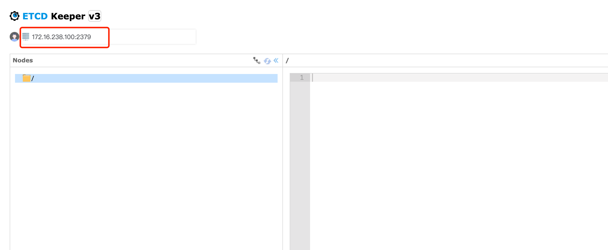

# grpc_etcd_example

## Proto3

1. [Protocol Buffer Language Guide](https://developers.google.com/protocol-buffers/docs/proto3)
2. [Python 生成代码](https://developers.google.com/protocol-buffers/docs/reference/python-generated)

## Python

1. pip install grpcio
2. pip install grpcio-tools

#### Warning

> /Users/lishulong/PycharmProjects/grpc_etct_example
>
> python -m grpc_tools.protoc -I . --python_out=. --grpc_python_out=.  ./protos/query_example.proto 
>
> 想要生成在哪个包下，就把proto放到哪个包下，不用生成文件的包路径了

## Etcd

1. pip install etcd3
2. docker-compose up
3. http://127.0.0.1:8010/，修改下面红框的地址用来进行etcd的服务链接

### 参考链接

1. https://github.com/kragniz/python-etcd3,https://pypi.org/project/etcd3/
2. https://grpc.io/docs/languages/python/quickstart/
3. https://github.com/evildecay/etcdkeeper
4. https://github.com/lishulongVI/script-book/blob/release/etcd-docker-compose.yml

